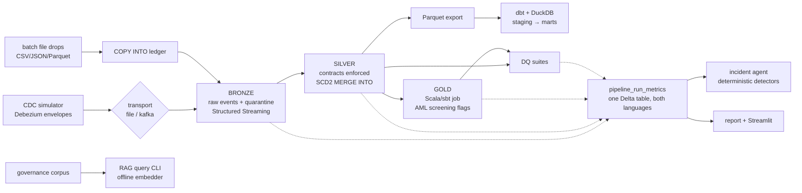

# lakehouse-platform

A **local-first lakehouse** on a synthetic retail-banking domain — built as a
working reference of senior Data & AI engineering practice: CDC ingestion,
Medallion architecture on Delta Lake, contracts and quality as code,
governance for regulated environments, and applied LLM engineering. Every
piece runs on a laptop with **zero paid infrastructure**, and CI proves the
quickstart works end-to-end.

```bash
uv sync --group dev   # Python 3.11 + Java 21 required
make demo             # CDC → bronze → silver → gold(Scala) → dbt → DQ → RAG → incident agent
```

```
  [     ok] cdc_simulate                 0.6s      [     ok] dbt_build          6.0s
  [     ok] bronze_stream               20.5s      [     ok] data_quality      34.4s
  [     ok] bronze_copy_into            23.8s      [     ok] rag_demo           0.3s
  [     ok] silver_historize            37.6s      [     ok] incident_agent     0.6s
  [     ok] gold_scala                  23.5s      ...all steps green
```

## Architecture



Full narrative and local→production mapping: [`docs/architecture.md`](docs/architecture.md).
Design decisions with real trade-off analysis: [`docs/adr/`](docs/adr) (7 ADRs).

## Skills matrix

| Module | What it demonstrates |
|---|---|
| [`ingestion/cdc_simulator`](ingestion/cdc_simulator) | **CDC**, Debezium envelope semantics, deterministic data generation, Kafka producers |
| [`pipelines/bronze`](pipelines/bronze) | **PySpark Structured Streaming**, checkpointed exactly-once, quarantine patterns, **COPY INTO** semantics with an auditable file ledger |
| [`pipelines/silver`](pipelines/silver) | **Delta Lake MERGE INTO**, **SCD Type 2** historization, deduplication, schema evolution, **Medallion architecture** |
| [`pipelines/gold_scala`](pipelines/gold_scala) | **Scala + sbt** Spark jobs, cross-language platform contracts, AML-style transaction screening |
| [`transform/dbt_project`](transform/dbt_project) | **dbt** (staging/marts/tests/exposures/docs) on DuckDB, PII-minimized modeling |
| [`quality/contracts`](quality/contracts) | **Data contracts** as versioned YAML, pydantic validation, enforced compatibility evolution |
| [`quality/expectations`](quality/expectations) | **Data quality** engineering: declarative suites, severity model, results-as-data |
| [`governance/unity_catalog`](governance/unity_catalog) | **Unity Catalog** grants-as-code, contract-derived **PII classification**, lineage |
| [`governance/compliance`](governance/compliance) | **Governance in regulated environments** (FSA/FISC-style control mapping) |
| [`platform/terraform`](platform/terraform) | **Terraform**: **Databricks** workspace + UC metastore/catalogs/grants on AWS, deploy-ready |
| [`platform/docker`](platform/docker) | Local infra parity: Postgres logical replication, Redpanda, MinIO |
| [`ai/rag_pipeline`](ai/rag_pipeline) | **RAG**: chunking, pluggable embeddings (offline-first), retrieval with citations |
| [`ai/agents`](ai/agents) | **LLM agents** done responsibly: deterministic detection, LLM-optional narration |
| [`observability/metrics`](observability/metrics) | Pipeline observability: one metrics schema across Python and Scala, dashboarding |
| [`.github/workflows`](.github/workflows) | **CI/CD**: lint/type gates, Spark tests, hermetic dbt, ScalaTest, terraform validate, end-to-end demo smoke |

## Design highlights (the parts worth reading)

- **One envelope, two transports** — the demo needs zero infrastructure, yet
  the Kafka path is code-complete: bronze normalizes NDJSON files and Kafka
  topics into one schema before any logic runs ([ADR 006](docs/adr/006-file-vs-kafka-dual-mode-transport.md)).
- **Contracts are executable** — the same reviewed YAML drives silver's
  parsing schema, quarantine rules, UC PII tags, and the audit inventory.
  Evolution is gated by a compatibility checker; a compatible v1→v2 flows
  through the SCD2 MERGE via Delta schema evolution with no DDL.
- **Quarantine over fail-fast, severities over panic** — bad *records* are
  isolated with named reasons and surface as DQ warns; bad *systems* fail
  loudly into the metrics table ([ADR 004](docs/adr/004-quarantine-vs-fail-fast.md)).
  The demo seeds 2% corrupt events so you can watch the whole chain:
  quarantine → RI warns → incident-agent finding that names the root cause.
- **ANSI mode stays on** — dirty data is handled at explicit edges with
  `try_cast`/permissive parsing, never by globally disabling correctness
  ([ADR 007](docs/adr/007-ansi-mode-on.md)).
- **The LLM is never load-bearing** — the incident agent's detection is
  deterministic and unit-tested; a Claude backend (gated, optional)
  improves prose only. The RAG pipeline defaults to a dependency-free
  hashing embedder so `make rag` and CI are hermetic; sentence-transformers
  drops in behind the same protocol.

## Repository layout

```
platform/       docker compose (Postgres/Redpanda/MinIO) + deploy-ready Terraform (Databricks/UC/AWS)
ingestion/      CDC simulator (Debezium envelopes) + batch landing generator
pipelines/      bronze (streaming + copy-into) · silver (SCD2/contracts) · gold_scala (sbt)
transform/      dbt project on DuckDB over exported silver snapshots
quality/        versioned data contracts + custom DQ framework
governance/     UC grants-as-code, generated PII tags, FISC/FSA control matrix
ai/             offline RAG pipeline + incident-report agent
observability/  cross-language metrics table, static report, Streamlit dashboard
orchestration/  the end-to-end demo driver
docs/           architecture + 7 ADRs
```

## Working with it

```bash
make help          # all targets
make up            # optional: start Redpanda/Postgres/MinIO for the kafka path
LAKEHOUSE_SOURCE_MODE=kafka make cdc bronze   # exercise the broker transport
make test          # pytest: unit + Spark integration (SCD2 invariants, quarantine counts)
./scripts/sbt test # ScalaTest
make lint          # ruff + mypy (strict) — CI gates
make dashboard     # Streamlit over the metrics export (uv sync --extra dashboard)
```

All data is synthetic (seeded Faker) — no real personal or financial data
exists anywhere in this repository.
