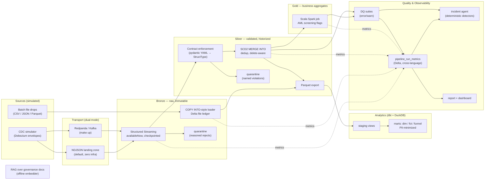

# Architecture

## System overview

## Data flow narrative

1. **Sources.** A seeded simulator plays the role of a Debezium Postgres
   connector over the banking schema (`platform/docker/initdb`), emitting
   `before/after/op/ts_ms/source` envelopes — including a configurable
   fraction of deliberately corrupt events. Reference data lands as
   heterogeneous file drops, including byte-identical resends.
2. **Transport is swappable; the payload is the contract** (ADR 006). The
   same bytes flow via NDJSON files (default) or Kafka; bronze normalizes
   both to one envelope schema before any logic runs.
3. **Bronze keeps everything, raw** (ADR 004). A checkpointed streaming job
   splits structurally-valid events into per-entity Delta tables (payloads
   stay as raw JSON) and routes broken lines to quarantine with reasons.
   Batch files load exactly once through an explicit Delta ledger (ADR 001).
4. **Silver makes data trustworthy.** Payloads are parsed against
   contract-compiled schemas (permissive parse, explicit enforcement — ADR
   007); violations quarantine with named rules; version chains are
   recomputed and MERGEd as SCD Type 2 (ADR 002); deletes close chains,
   satisfying erasure without destroying audit history.
5. **Gold aggregates in Scala** — per-account daily metrics with AML-style
   screening flags — proving the JVM half of the platform and writing to
   the same metrics table as the Python side.
6. **Analytics runs on dbt + DuckDB over explicit Parquet exports** (ADR
   003): staging narrows SCD2 to current state; marts are PII-minimized by
   construction, mirroring the Unity Catalog grant model.
7. **Quality and observability are data.** DQ suites (ADR 005) and every
   pipeline step write to one metrics Delta table; the static report,
   Streamlit dashboard, and the deterministic incident agent are all just
   readers. The RAG pipeline answers questions over the governance corpus
   that documents all of the above.

## Production mapping

| Local | Production (Terraform-provisioned) |
|---|---|
| `data/lakehouse/{bronze,silver,gold}` paths | Unity Catalog catalogs on S3 external locations |
| Directory conventions | Catalog/schema grants, `ISOLATED` catalogs |
| File landing zone / Redpanda | Debezium → Kafka/MSK, or Auto Loader on S3 drops |
| `scripts/run_gold.sh` spark-submit | Databricks Jobs (jar task) |
| dbt-duckdb over exports | dbt-databricks over UC tables |
| Metrics Delta table | Same table, UC-governed; feeds real alerting |

The Terraform under `platform/terraform` provisions the right-hand column
(workspace, metastore, catalogs, grants) and is validated in CI; applying it
is a deliberate, credentialed act outside this repo's demo path.
